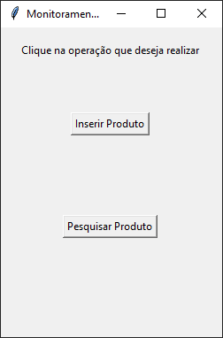

# SCC0640
Trabalho final da disciplina SCC-0640.

## Pré-requisitos
Para efetuar a conexão da aplicação ao SGBD, é necessário instalar o [Oracle Instant Cliente](https://www.oracle.com/br/database/technologies/instant-client/winx64-64-downloads.html).
Além disso é necessário instalar algumas bibliotecas, os comandos para a instalação são:

```
pip install cx_Oracle
pip install tkinter
pip install pandas
```

## Conectando ao SGBD
Para a conexão da aplicação com o SGBD, crie um arquivo chamado **__sqlConnection__**, que deverá conter o código abaixo:

```python

import cx_Oracle

"""
Configurando os parâmetros da conexão
"""
# Diretorio onde está o instantclient
cx_Oracle.init_oracle_client(lib_dir=r"ENDEREÇO DO INSTANT CLIENTE NO SEU PC")

# Configurações do servidor
ip = 'IP DA SUA CONEXÃO'
port = 'PORTA DA SUA CONEXÃO'
SID = 'SID DA SUA CONEXÃO'
dsn_tns = cx_Oracle.makedsn(ip, port, SID)

# Configurações do usuário
username = 'SEU_USUARIO'
password = 'SUA_SENHA'

def connect():
    try:
        conn = cx_Oracle.connect(username, password, dsn_tns)
    except Exception as err:
        print('Erro ao estabelecer a conexão ', err)
    else:
        print(conn.version)
        print('Conexão Estabelecida')
    
    return conn
```

## A aplicação
Foram implementadas as opções funções:



- Cadastro de um produto: essa função que insere um produto no estoque de um ponto de coleta específico

