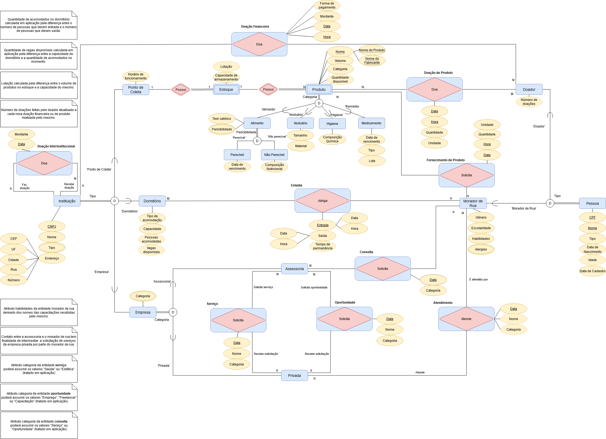

# SCC0640
Conclusão do projeto desenvolvido para a disciplina **__SCC0640 - Bases de Dados__**, ministrada pelo **__Instituto de Ciências Matemáticas e de Computação (ICMC)__** da *__Universidade de São Paulo (USP)__* durante o segundo semestre de 2021. O intuito principal era projetar o banco de dados para o sistema e também desenvolver uma aplicação que fosse capaz de interagir com o mesmo.

Trata-se de um sistema desenvolvido para facilitar o monitoramento e atendimento das demandas de moradores de rua (algumas liberdades foram tomadas ao decorrer do projeto, de forma que o resultado final não necessariamente reflete de forma fidedigna a realidade brasileira).



## Pré-requisitos
Para efetuar a conexão da aplicação ao SGBD, é necessário instalar o [Oracle Instant Cliente](https://www.oracle.com/br/database/technologies/instant-client/winx64-64-downloads.html).
Além disso é necessário instalar algumas bibliotecas, os comandos para a instalação são:

```
pip install cx_Oracle
pip install tkinter
pip install pandas
```

## Conectando ao SGBD
Para a conexão da aplicação com o SGBD, crie um arquivo chamado **__sqlConnection.py__**, que deverá conter o código abaixo:

```python

import cx_Oracle

"""
Configurando os parâmetros da conexão
"""
# Diretorio onde está o instantclient
cx_Oracle.init_oracle_client(lib_dir=r"ENDEREÇO DO INSTANT CLIENTE NO SEU PC")

# Configurações do servidor
ip = 'IP DA SUA CONEXÃO'
port = 'PORTA DA SUA CONEXÃO'
SID = 'SID DA SUA CONEXÃO'
dsn_tns = cx_Oracle.makedsn(ip, port, SID)

# Configurações do usuário
username = 'SEU_USUARIO'
password = 'SUA_SENHA'

def connect():
    try:
        conn = cx_Oracle.connect(username, password, dsn_tns)
    except Exception as err:
        print('Erro ao estabelecer a conexão ', err)
    else:
        print(conn.version)
        print('Conexão Estabelecida')
    
    return conn
```
Para o código funcionar é necessário substituir 'SEU_USUARIO' e 'SUA_SENHA' pelo dados da sua conexão Oracle. Vale ressaltar que é necessário também substituir "ENDEREÇO DO INSTANT CLIENTE NO SEU PC" pelo endereço em que foi instalado o instantclient, além de incluir este diretório nas variantes de ambiente "Path" do computador.

## A aplicação
Foram implementadas as seguintes funções:


- **__Cadastro de um produto__**: essa função que insere um produto no estoque de um ponto de coleta específico


- **__Busca de produto__**: essa função permite buscar um produto por **__nome__**


E tem como retorno a lista de todos os pontos de coleta que possuem estoque desse item disponível, ordenados pela data de validade:


